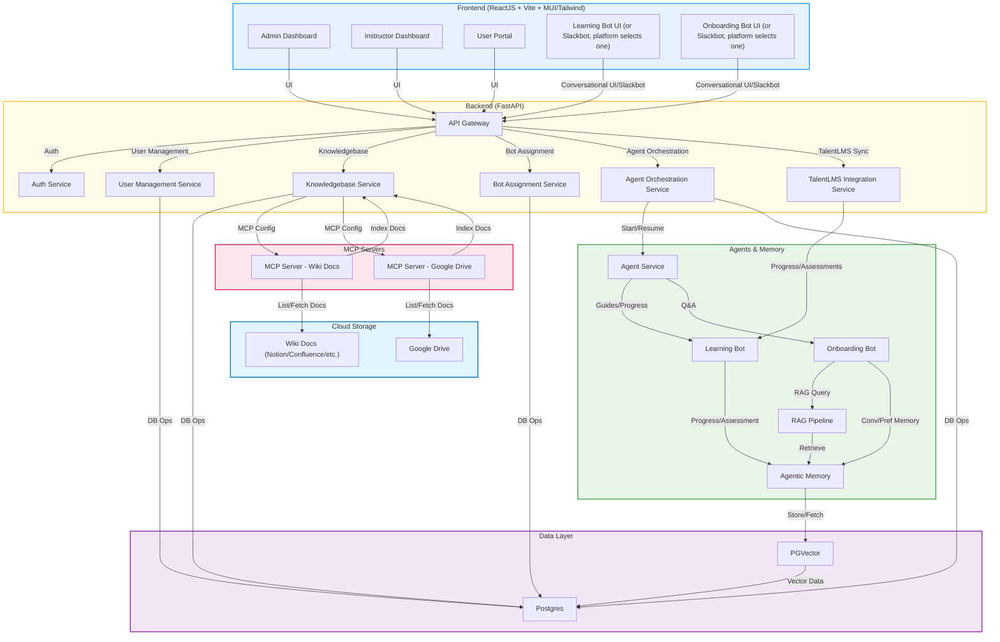

# Genie Mentor Agent: System Architecture

## Overview

The Genie Mentor Agent platform is implemented as a set of microservices that communicate with each other through well-defined APIs. This architecture provides scalability, flexibility, and allows for independent development and deployment of components.

## Architecture Diagram

## Microservices

1. **API Gateway**
   - Single entry point for frontend and external clients
   - Routes requests to appropriate services
   - Handles authentication and authorization
   - Provides API documentation and discovery

2. **Bot Service**
   - Implements the core agent orchestration
   - Contains both Learning Bot and Onboarding Bot implementations
   - Uses LangGraph for agent workflows
   - Consumes Memory Service for state management
   - Communicates with Data Ingestion Service for document retrieval

3. **Memory Service**
   - Manages all forms of agentic memory
   - Implements LangMem for conversation, learning progress, and preference memory
   - Provides memory persistence and retrieval
   - Optimizes memory context for agent consumption

4. **Data Ingestion Service**
   - Manages document sources via MCP connectors
   - Handles document processing, chunking, and embedding
   - Maintains vector store for semantic search
   - Implements RAG query pipeline
   - Provides admin tools for knowledgebase management

5. **Integration Service**
   - Integrates with TalentLMS for course and progress synchronization
   - Provides Slack connectors for bot delivery
   - Implements webhooks for external system notifications

## Inter-Service Communication

- **REST APIs**: For synchronous request/response patterns
- **Message Queue**: RabbitMQ for asynchronous event-driven communication
- **Service Discovery**: Using container orchestration service discovery mechanisms
